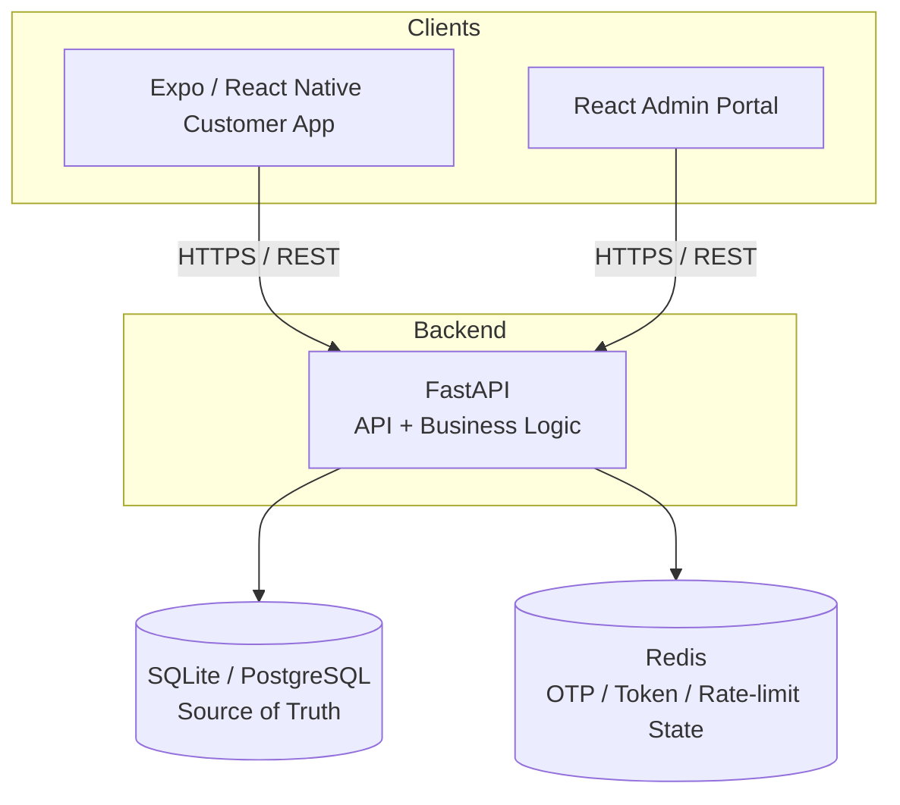

# Digital Bank Locker Management Platform

A centralized, secure, auditable, real-time digital workflow that replaces the
traditional paper-based, physical-key-dependent bank locker process.

> **Central product narrative:** digitize the *controlled workflow* around the
> bank locker — not merely the paperwork.

---

## 1. Problem Statement

Traditional bank locker operations rely on:

- Paper-based locker registers and manual forms
- Physical-key dependency and manual customer verification
- Manual bank-staff authorization with no centralized live locker-state visibility
- Difficult audit reconstruction and slow branch operations
- Fragmented customer/request information and potential administrative leakage

## 2. Solution

A digitized workflow with **two client applications** talking to a single
authoritative backend:

```
Customer Request → Identity Verification → Dual-Token Verification
     → Bank Authorization → Locker Operation → State Update → Audit Event
```

1. **Customer Mobile App** (Expo / React Native) — login (including face
   recognition login), submit and track locker requests, complete identity
   verification.
2. **Bank Admin Portal** (React + TypeScript + Tailwind) — live vault grid, request queue, dual-control verification console, compliance timeline.

Both communicate **exclusively** through the FastAPI backend, which is the sole
owner of business logic, authorization, and state transitions.

## 3. Architecture



**Non-negotiable architectural rules honored throughout:**
- No P2P — one authoritative backend.
- No NoSQL — SQLite (default) or PostgreSQL is the relational source of truth.
- The backend owns all business/authorization logic; neither client makes
  trust decisions, including for face recognition login — the backend is
  the sole arbiter of whether a face match is accepted.
- Redis holds only ephemeral state (OTPs, verification tokens, rate limits) —
  never the permanent record.
- Every privileged/state-changing operation writes an append-only audit event.

## 4. Tech Stack

| Layer | Technology |
|---|---|
| Customer App | Expo, React Native, TypeScript |
| Admin Portal | React 18, TypeScript, Tailwind CSS, React Router |
| Backend | Python, FastAPI, Pydantic, SQLAlchemy, Alembic, JWT |
| Database | SQLite (default, zero-install) or PostgreSQL |
| Cache / Ephemeral State | Redis (with automatic in-memory fallback) |
| Face Recognition | TensorFlow.js (on-device, pure JavaScript — Expo Go compatible) |
| Infra | Docker, Docker Compose (optional) |
| Testing | pytest + FastAPI TestClient (backend) |

## 5. Repository Structure

```
bank-locker-platform/
├── backend/            FastAPI + SQLAlchemy + Alembic + Redis + pytest
│   ├── app/
│   │   ├── api/routes/      auth, face_auth, customers, requests, verification, admin, audit, branches, notifications
│   │   ├── core/             config, database, security, redis_client, enums, responses
│   │   ├── models/           SQLAlchemy models (single source, portable UUID PKs)
│   │   ├── schemas/          Pydantic request/response schemas
│   │   ├── services/         audit_service, state_machine, verification_service
│   │   ├── middleware/       rate_limit
│   │   └── main.py
│   ├── alembic/               migrations (0001_initial_schema, 0002_add_face_embedding)
│   ├── tests/                 auth, locker workflow, dual-token verification, audit
│   └── app/seed.py            demo data generator
├── admin-web/           React + TS + Tailwind bank admin portal
│   └── src/{components,pages,layouts,hooks,services,types}
├── customer-mobile-expo/ Expo / React Native customer app
│   └── src/{api,components,context,navigation,screens,theme,utils}
├── docker-compose.yml
└── .env.example
```

## 6. Database Architecture

Core tables (see `backend/app/models/models.py` and
`backend/alembic/versions/`):

`users` · `branches` · `lockers` · `locker_requests` · `verification_tokens` ·
`audit_events` · `notifications`

Key design points:
- Every `locker_request` carries a `correlation_id` — every audit event for
  that request/locker chain shares it, so the full story of one operation can
  be reconstructed with a single query (`GET /audit/timeline/{correlation_id}`).
- `verification_tokens` stores a **hash** of the token for durable audit
  evidence; the live secret and attempt counter live in Redis with a TTL and
  are deleted the moment a token is consumed (replay prevention).
- `users.face_embedding` stores an optional on-device-generated face
  embedding (nullable) used only for face recognition login — never a raw
  photo or biometric image.
- Indexes on locker status, request status/timestamp, audit actor/entity/timestamp/correlation_id.
- UUID primary keys are stored as portable `String(36)` so the same models
  run against PostgreSQL in production and SQLite by default.

## 7. Locker & Request State Machines

All transitions are enforced in `backend/app/services/state_machine.py` — the
**only** place a locker or request status can change. Illegal transitions
raise `409 INVALID_STATE_TRANSITION`. Neither frontend can bypass this.

```
Locker:   AVAILABLE → OCCUPIED → VERIFICATION_PENDING → ACCESS_ACTIVE → OCCUPIED
                              ↘ MAINTENANCE / RESTRICTED (from most states)

Request:  SUBMITTED → VERIFICATION_PENDING → TOKEN_A_VERIFIED → TOKEN_B_VERIFIED
              → APPROVED → ACCESS_ACTIVE → COMPLETED
          (REJECTED / EXPIRED / CANCELLED reachable from earlier states)
```

## 8. Dual-Token Verification (Killer Feature)

Implemented in `backend/app/services/verification_service.py`:

1. Bank staff call `POST /verification/{request_id}/generate` → backend
   creates a `CUSTOMER_TOKEN` and `BANK_TOKEN` (6-digit), stores the live
   secret + attempt counter in Redis with a TTL, and persists a SHA-256 hash
   of each in PostgreSQL/SQLite for durable audit evidence.
2. Customer verifies their token → `POST /verification/{request_id}/verify/customer`.
3. Bank operator verifies their token → `POST /verification/{request_id}/verify/bank`.
4. When both are valid: request → `APPROVED` → `ACCESS_ACTIVE`, locker →
   `ACCESS_ACTIVE`, and an `ACCESS_AUTHORIZED` audit event is written.

Enforced server-side: expiry, one-time use (Redis key deleted immediately on
success), maximum attempts (`VERIFICATION_TOKEN_MAX_ATTEMPTS`, default 3),
correct request/token-type pairing, and ordering (bank token cannot be
verified before the customer token).

## 9. Face Recognition Login (Customer App)

An alternative login path to email/password, available on the customer
mobile app only:

1. After logging in normally at least once, the customer opens **Profile →
   Enroll Face**. The app captures a short-lived camera frame, computes a
   face embedding **on-device**, and sends only the embedding (never a raw
   photo) to `POST /face-auth/enroll`, where it's stored against their
   account.
2. On a future login, the customer taps **Log in with Face** on the login
   screen, the app again computes an on-device embedding from a fresh camera
   frame, and sends it with the account's email to `POST /face-auth/login`.
3. The backend compares the submitted embedding to the stored one using
   cosine similarity against a configurable match threshold. A match returns
   the same `{access_token, refresh_token, token_type, user}` shape as a
   normal login; a non-match is rejected with `401 UNAUTHORIZED` — exactly
   like an incorrect password.

**Implementation approach:** face detection and embedding computation run
entirely on-device via TensorFlow.js (`@tensorflow/tfjs-react-native` +
BlazeFace), chosen specifically because it works inside **Expo Go** with no
native rebuild/eject step required. This keeps the whole team on the same
zero-native-tooling workflow used for the rest of the app.

**Honest limitation:** this uses face-landmark geometry rather than a deep
recognition network (e.g. FaceNet/ArcFace), so treat it as a demo-grade
convenience login, not a production biometric security control — see
Section 16.

## 10. API Overview

Base path `/api/v1`. Full interactive docs at `/docs` (Swagger) and `/redoc`.

```
POST   /auth/login | /auth/refresh | /auth/logout
POST   /face-auth/enroll | /face-auth/login

GET    /customers/me | /customers/me/locker | /customers/me/requests

POST   /requests                      submit a new request
GET    /requests/{id}                 get status/detail
POST   /requests/{id}/cancel

POST   /verification/{id}/generate
POST   /verification/{id}/verify/customer
POST   /verification/{id}/verify/bank

GET    /admin/dashboard | /admin/lockers | /admin/requests
POST   /admin/requests/{id}/approve | /reject | /start | /complete

GET    /audit | /audit/{id} | /audit/timeline/{correlation_id}

GET    /branches | /branches/{id}
GET    /notifications | POST /notifications/{id}/read
GET    /health
```

Consistent response envelope:

```json
{ "success": true, "data": { ... }, "message": "Operation completed successfully" }
{ "success": false, "error": { "code": "INVALID_TOKEN", "message": "..." } }
```

## 11. Setup Instructions

### Option A — Docker Compose (recommended if Docker is available)

```bash
cp .env.example .env
docker compose up -d
```

This starts PostgreSQL, Redis, the FastAPI backend (auto-runs Alembic
migrations + seeds demo data on boot), and the admin web portal.

| Service | URL |
|---|---|
| Backend API | http://localhost:8000 |
| Swagger UI | http://localhost:8000/docs |
| Admin Portal | http://localhost:3000 |
| PostgreSQL | localhost:5432 |
| Redis | localhost:6379 |

### Option B — Run services independently, zero extra installs (recommended if Docker isn't available)

The backend needs **only Python** — no Postgres or Redis install required.
By default it uses a local SQLite file (`backend/locker.db`) and an
in-memory Redis substitute that's used automatically whenever a real Redis
server isn't reachable at `REDIS_URL`. If you do have Postgres/Redis running
and want to use them instead, set `DATABASE_URL`/`REDIS_URL` in a
`backend/.env` file (copy from `.env.example`) — the real services are used
automatically when reachable.

```bash
cd backend
python -m venv venv && source venv/bin/activate   # Windows: venv\Scripts\activate
pip install -r requirements.txt
python -m app.seed        # creates locker.db and seeds demo data — no migration step needed
uvicorn app.main:app --reload --host 0.0.0.0
```

**Admin Web**
```bash
cd admin-web
npm install
npm run dev   # http://localhost:5173, VITE_API_BASE_URL defaults to http://localhost:8000
```

**Customer Mobile (Expo / React Native)**
```bash
cd customer-mobile-expo
cp .env.example .env
# edit .env: set EXPO_PUBLIC_API_BASE_URL to your machine's LAN IP (needed for a
# physical phone via Expo Go), e.g. http://192.168.1.14:8000
npm install
npx expo start
```
Scan the printed QR code with the **Expo Go** app on your phone (same Wi-Fi
network as your computer). For face login, also install the camera/ML
dependencies:
```bash
npx expo install expo-camera expo-gl expo-gl-cpp
npm install @tensorflow/tfjs @tensorflow/tfjs-react-native @tensorflow-models/blazeface
```

### Running Tests

```bash
cd backend
pip install -r requirements.txt
pytest -v
```

Tests run against an isolated SQLite database per test with a fake Redis
client — no external services required.

## 12. Demo Credentials

All development-only accounts share the password **`Demo@1234`**.

| Role | Email |
|---|---|
| Customer | `customer@demo.bank` |
| Bank Operator | `operator@demo.bank` |
| Branch Manager | `manager@demo.bank` |
| Super Admin | `admin@demo.bank` |

The seed script also creates ~126 lockers across 3 branches, 25 customers,
and a representative spread of request states — the admin dashboard is
populated immediately after startup. A locker (`A1`, Pune Camp Main Branch)
is pre-assigned to `customer@demo.bank` with a fresh `SUBMITTED` request,
ready for a live walkthrough.

## 13. Feature List

- JWT auth (access + refresh) with bcrypt password hashing
- Face recognition login for the customer app (on-device embedding, backend-verified match)
- RBAC across `CUSTOMER`, `BANK_OPERATOR`, `BRANCH_MANAGER`, `SUPER_ADMIN` — enforced server-side only
- Backend-owned locker & request state machines with illegal-transition rejection
- Dual-token (two-party) verification with Redis TTL, one-time use, attempt limiting
- Live visual vault grid with branch/status/size/search filtering and a detail panel
- Request queue with approve/reject/start/complete actions
- Compliance & Audit center with KPIs, filters, and a full chronological timeline per request (`correlation_id`)
- Redis-backed rate limiting on verification endpoints
- Realistic seed data across branches, lockers, customers, requests, and audit history
- Customer app: login (email/password and face), home, my locker, request access, dual-token verification, request tracking, notifications, profile

## 14. Security Model

- **Auth:** JWT access (30 min default) + refresh (7 day default) tokens, bcrypt password hashing.
- **Face login:** on-device embedding computation means a raw photo never leaves the phone; only a numeric embedding is transmitted and stored. The backend never treats a face match as sufficient for anything beyond ordinary login — it grants exactly the same session a password login would, no elevated trust.
- **Authorization:** RBAC dependency guards on every route (`require_customer`, `require_staff`, `require_manager`, `require_super_admin`) — never enforced only in the frontend.
- **API security:** Pydantic request validation, CORS allow-list, no stack traces leaked to clients (global exception handler returns a generic `INTERNAL_ERROR`), consistent error envelope.
- **OTP/token security:** short TTL (default 5 min), one-time use (Redis key deleted on success), maximum attempt count (default 3), rate limiting on verification endpoints (default 5/min/IP).
- **Audit security:** every privileged operation (login, face login, state transition, verification attempt/success/failure, approval, rejection, completion) writes an append-only `audit_events` row.
- **Logging:** structured logs include timestamp, level, request ID, endpoint, and duration — never passwords, raw OTPs, raw verification tokens, or face embeddings.

## 15. Testing

`backend/tests/` covers:
- **Auth:** successful login, invalid password, invalid/garbage token, missing auth header.
- **Authorization:** customer blocked from admin endpoints, operator/manager permissions verified.
- **Locker workflow:** valid request creation, duplicate-request rejection, request on an unowned/unavailable locker, invalid state transitions.
- **Dual-token verification:** full success path, wrong token, reused/out-of-order verification, excessive attempts, cross-customer access blocked.
- **Audit:** login and request submission generate events; audit endpoint is staff-only.

## 16. Known Prototype Limitations

- Real-time updates use polling (6–8s intervals), not WebSockets/SSE — reliable and simple, per hackathon priorities, but not instantaneous.
- No SMS/email gateway integration — verification tokens are returned directly in the API response to simulate out-of-band delivery for demo purposes; a production system would never do this.
- No real KYC/identity-document verification — "identity verification" here means the customer's authenticated session, not biometric/document checks.
- **Face recognition login is demo-grade, not production biometric security.** It uses on-device face-landmark geometry (via BlazeFace/TensorFlow.js) rather than a trained deep recognition network like FaceNet or ArcFace, chosen specifically to stay compatible with Expo Go without a native build step. It's suitable for showing the concept and rejecting an obviously different face, but should not be represented as bank-grade biometric security.
- No hardware/vault controller integration — `ACCESS_ACTIVE` is a software state, not a physical unlock signal.
- Customer mobile app ships the P0 flow (login, locker, request, dual-token verification, tracking, notifications, profile) with a light custom UI; deeper mobile polish (rich empty states, offline caching, push notifications) is intentionally out of scope for the hackathon window.
- Single JWT secret / symmetric signing — production would use asymmetric keys and a secrets manager.
- No HSM-backed cryptography — token hashing uses SHA-256, sufficient for hackathon audit-evidence purposes, not a production HSM-backed scheme.

## 17. Future Production Roadmap

- Integrate with bank core systems and enterprise IAM (SSO/OIDC) instead of standalone JWT.
- Real KYC / identity verification providers.
- Upgrade face recognition from landmark-geometry matching to a trained deep embedding model (e.g. FaceNet/ArcFace) served via a proper native ML pipeline, with liveness detection to prevent photo/video spoofing.
- Hardware/vault controller integration for a true physical unlock signal tied to `ACCESS_ACTIVE`.
- HSM-backed cryptographic infrastructure for token generation/signing.
- SMS/email gateways for genuine out-of-band token delivery.
- SIEM integration and centralized observability (structured logs → log pipeline, metrics, tracing).
- Disaster recovery, high availability (multi-AZ Postgres, Redis clustering).
- Regulatory data-retention policies for audit events and face embeddings.
- WebSocket/SSE-based real-time state propagation to replace polling.

---

## Appendix: 5-Minute Judge Demonstration Sequence

1. **Customer (0:00–1:00):** Log in as `customer@demo.bank` (or demonstrate
   **Log in with Face** if enrolled) → Home shows Locker `A1`, status
   `OCCUPIED` → tap **Request Access** → submit.
2. **Admin — Request Queue (1:00–1:30):** Log in to the admin portal as
   `operator@demo.bank` → **Requests** → the new request appears immediately
   → open it (customer, locker, verification, audit panels visible).
3. **Dual Verification (1:30–2:30):** Click **Generate Verification Tokens**
   → demo customer/bank tokens are displayed → verify the customer token →
   `✓ CUSTOMER VERIFIED` → verify the bank token → `✓ BANK VERIFIED` →
   **ACCESS AUTHORIZED**.
4. **Live Vault (2:30–3:15):** Navigate to **Locker Vault** → locker `A1` is
   now `ACCESS_ACTIVE` (visibly changed color/state on the grid) — the "wow"
   moment.
5. **Completion (3:15–3:45):** Back on the request detail, click **Complete
   Operation** → locker returns to `OCCUPIED`.
6. **Compliance (3:45–5:00):** Open **Compliance & Audit** → filter by the
   request's correlation ID or entity → show the full chronological timeline:
   Request Created → Customer Verified → Bank Verified → Access Authorized →
   Locker Activated → Operation Completed.
